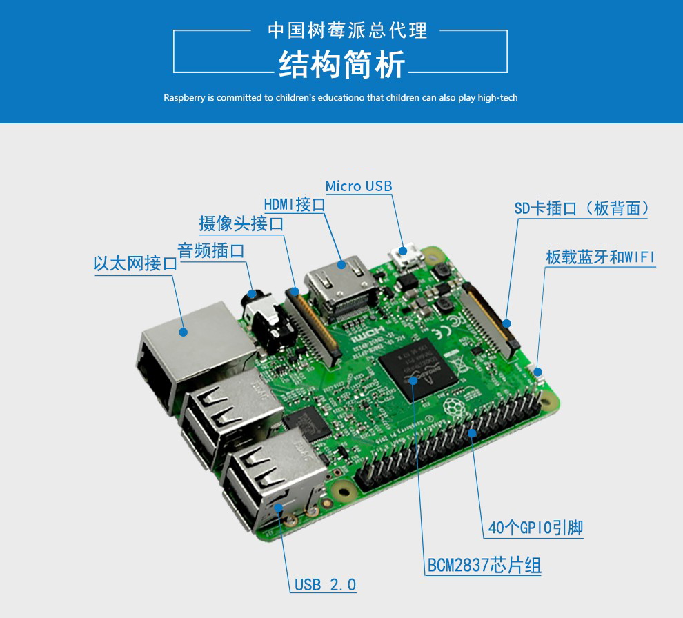
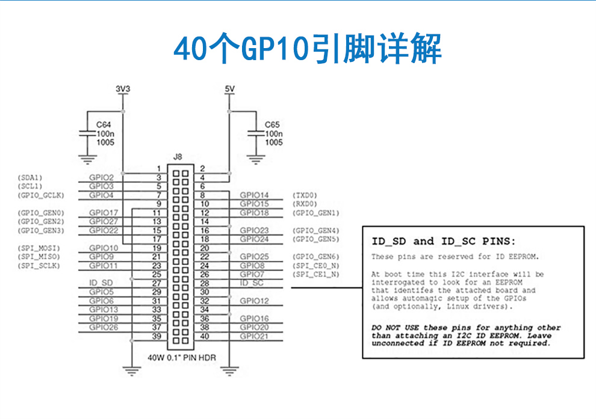

2018年3月20日，我拥有了一台树莓派（Raspberry Pi 3B)

它的参数如下：

参数名称|内容
---|---
RAM|1GB
CPU|1.2GHz 四核 Broadcom BCM2837 64位 ARM A53处理器
GPU|VideoCore
储存卡扩展槽|Micro SD
尺寸|85*56*17
重量|45克
HDMI|支持
RCA|支持
引脚扩展|40引脚扩展GP10
蓝牙|支持
无线局域网|802.11 b/g/n
USB2端口|4
摄像头|支持
音频|支持

